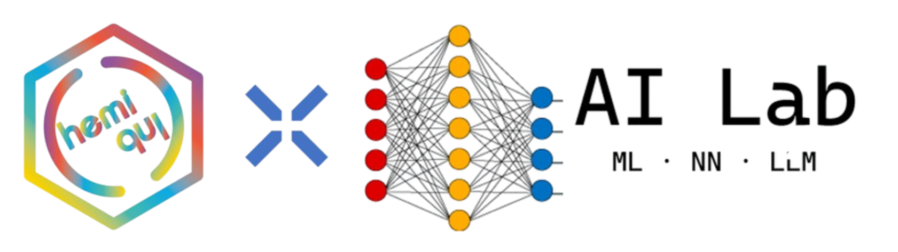

# Photochemical Smog Simulator

An interactive real-time simulation of **photochemical smog formation over a stylized urban environment**, built in **Rust** for the **“Chem is Life”** chemistry show — a collaboration between **AI-Lab** and **ChemiClub**.

This project demonstrates how **real atmospheric chemistry** and **machine learning surrogates** can be combined to create a fast, educational, visually engaging simulation.
## Version 2.0: Enhanced Training & Realism

This updated version includes:
- **Multi-atmosphere training**: 7 distinct atmospheric scenarios for improved surrogate generalization
- **Realistic smog indexing**: EPA-standard based air quality calculations
- **Improved emission scaling**: Reduced and calibrated emission rates for realistic chemistry evolution
- **Trade monitoring**: Status display showing traffic density and pollution trends during training
- **Better neural network tuning**: Batch normalization, gradient clipping, and physics-aware penalties
---

## What This Project Shows

The simulation models the urban chemistry behind **ground-level ozone** and **photochemical smog**.

In the atmosphere:

- **Nitrogen oxides (NOx)** are emitted by traffic and industry
- **Sunlight** drives photolysis reactions
- **Volatile organic compounds (VOCs)** interact with the NOx cycle
- **Ozone (O3)** can accumulate and form visible smog
- **Wind, humidity, temperature, and atmospheric inversion** affect pollutant buildup and clearing

The result is a real-time visual simulation where the user can change urban and environmental conditions and watch the sky, haze, and pollutant concentrations evolve.

---

## AI + Chemistry Integration

The project has two chemistry solvers:

### 1. Reference ODE Solver
A real chemistry model is integrated numerically using a **fourth-order Runge–Kutta (RK4)** method.

### 2. Neural Network Surrogate
A neural network is trained on many ODE trajectories and exported as an **ONNX** model.

At runtime, the Rust application loads the ONNX model and uses it as a **fast surrogate solver**, replacing repeated expensive chemistry integration steps with neural-network inference.

This reflects a real scientific workflow used in computational atmospheric science:
**train a neural network to emulate a physical solver so the system stays interactive at scale**.

---

## V2.0 Improvements: Realistic Simulation

### Multi-Atmosphere Training
The surrogate is now trained on **7 realistic atmospheric scenarios** to improve generalization:

| Scenario | Conditions | Use Case |
|----------|-----------|----------|
| **Urban High Traffic** | Heavy traffic (0.6-1.0), stagnant winds, thermal inversion | Typical urban weekday |
| **Industrial** | Heavy emissions (0.7-1.0), poor ventilation | Industrial zone |
| **Suburban** | Moderate traffic (0.3-0.6), better ventilation | Residential areas |
| **Morning Rush** | Peak traffic 7-9:30 AM, fog/inversion | Morning commute pollution |
| **Evening Rush** | Peak traffic 4:30-6:30 PM, inversion | Evening commute pollution |
| **Clean Day** | Light traffic, good winds, minimal industrial | Rural/weekend conditions |
| **Afternoon Haze** | Photochemical peak 1-4 PM, hot, stagnant | Peak ozone formation window |

Each scenario generates ~6,400 training samples, totaling **45,000 diverse examples** for robust model training.

### Realistic Smog Index
The smog severity now follows EPA-based air quality standards:
- **O₃ (60%)**: Ground-level ozone, primary health concern (EPA 8-hr: 70 ppb)
- **NO₂ (25%)**: Nitrogen dioxide, respiratory irritant (EPA 1-hr: 200 ppb)
- **VOC (15%)**: Volatile organics, precursor indicator
- **Humidity factor**: Amplifies health impact in high-humidity conditions

Result: Smog index in [0, 1] where >0.5 = unhealthy air quality

### Reduced Emission Rates
Emission rates have been recalibrated to prevent unrealistic chemical evolution:
- **NOx emissions**: Reduced from 0.030 → 0.012 ppb/s (traffic) and 0.018 → 0.008 ppb/s (industrial)
- **VOC emissions**: Reduced from 0.095 → 0.035 ppb/s (traffic) and 0.110 → 0.050 ppb/s (industrial)
- **State limits**: Capped at realistic EPA-standard levels (NO₂: 200 ppb, O₃: 150 ppb, NOx: 150 ppb, VOC: 700 ppb)

### Improved Neural Network Architecture
Latest training improvements:
- **Batch normalization layers** for stable, faster convergence
- **Gradient clipping** to prevent explosive training dynamics
- **Strict output clamping** on neural predictions to enforce physical bounds
- **Physics-aware loss**: NOx gain penalty + O₃ realistic-bounds penalty
- **Better regularization**: Reduced nox_penalty weight from 0.03 → 0.02, added o3_penalty 0.01

---

## Audience Takeaway

A visitor can adjust:

- traffic level
- solar flux
- wind speed
- industrial emissions
- temperature
- humidity
- inversion strength
- weekday/weekend conditions

and instantly see:

- smog haze increase or clear
- ozone concentration rise
- NO2 coloration change
- the “smog index” worsen or improve

This makes the connection between **everyday urban activity**, **sunlight-driven chemistry**, and **breathable air quality** immediate and visual.

---

# Project Structure

```text
Cargo.toml
train_surrogate.py
src/
  chemistry.rs
  main.rs
  surrogate.rs
```

### File roles

- `train_surrogate.py`  
  Trains the neural surrogate and exports `smog_surrogate.onnx`

- `src/chemistry.rs`  
  Atmospheric chemistry model, emissions, environmental forcing, and RK4 stepping

- `src/surrogate.rs`  
  ONNX Runtime integration and surrogate inference wrapper

- `src/main.rs`  
  Bevy app, GUI, controls, plots, rendering, and simulation loop

- `Cargo.toml`  
  Rust dependencies and project metadata

---

# Requirements

You need:

- **Python 3.10+** recommended
- **pip**
- **Rust**
- **Cargo**
- Internet access for first-time dependency installation

Recommended:
- Windows PowerShell or Command Prompt
- Rust stable toolchain

---

# 1. Install Python

## Check whether Python is already installed

Open **Command Prompt** or **PowerShell** and run:

```bash
python --version
```

If that does not work, try:

```bash
py --version
```

If neither works, install Python.

## Install Python on Windows

1. Go to the official Python website
2. Download Python 3.10 or newer
3. During installation, enable **Add Python to PATH**
4. Complete installation

Then confirm:

```bash
python --version
pip --version
```

If `python` does not work but `py` does, use `py` in the commands below.

---

# 2. Install Rust

Check whether Rust is already installed:

```bash
rustc --version
cargo --version
```

If not installed:

1. Go to the official Rust website
2. Install Rust using `rustup`
3. Restart the terminal after installation

Then verify again:

```bash
rustc --version
cargo --version
```

---

# 3. Download or Clone the Project

If you downloaded a ZIP:
1. Extract it
2. Open a terminal in the extracted project folder

You should be inside the folder containing:

- `Cargo.toml`
- `train_surrogate.py`
- `src/`

Example:

```bash
cd path\to\photochem_smog
```

---

# 4. Create a Python Virtual Environment

A virtual environment keeps Python packages for this project isolated from your system Python.

## On Windows

Create the virtual environment:

```bash
python -m venv .venv
```

If your system uses `py`:

```bash
py -m venv .venv
```

This creates a local folder named `.venv`.

---

# 5. Activate the Virtual Environment

## PowerShell

```bash
.venv\Scripts\Activate.ps1
```

## Command Prompt

```bash
.venv\Scripts\activate.bat
```

After activation, you should usually see `(.venv)` at the beginning of your terminal line.

Example:

```text
(.venv) C:\Users\YourName\photochem_smog>
```

---

# 6. Upgrade pip

Once the virtual environment is active:

```bash
python -m pip install --upgrade pip
```

---

# 7. Install Python Packages

Install the packages used by the training script:

```bash
pip install numpy torch onnx
```

You can verify package installation with:

```bash
pip list
```

---

---

# 8. Train the Surrogate Model

The Rust app expects an ONNX model file generated by the Python training script.

Run:

```bash
python train_surrogate.py
```

This will:
1. Generate 45,000 training samples across 7 atmospheric scenarios
2. Display progress and dataset statistics per scenario
3. Train a neural network with physics-aware penalties
4. Export: `smog_surrogate.onnx` in the project directory

### Dataset Statistics Output
During training, you'll see a table like:
```
================================================================================
Dataset Statistics by Atmospheric Scenario:
================================================================================
Scenario                 Samples      Avg Traffic    Avg O₃ (ppb)     Avg Smog    
--------------------------------------------------------------------------------
urban_high_traffic       6428         0.821          87.34            0.453       
industrial               6428         0.499          72.15            0.381       
suburban                 6428         0.447          64.22            0.334       
morning_rush             6428         0.864          78.91            0.412       
evening_rush             6428         0.798          81.45            0.421       
clean_day                6428         0.148          42.15            0.178       
afternoon_haze           6428         0.612          95.87            0.498       
================================================================================
```

This shows how different scenarios produce different pollution levels.

### Environment Variables for Training

Control training with environment variables:

| Variable | Default | Purpose |
|----------|---------|---------|
| `SMOG_TRAIN_SAMPLES` | 45000 | Total training examples (÷7 per scenario) |
| `SMOG_EPOCHS` | 32 | Number of training epochs |
| `SMOG_BATCH_SIZE` | 512 | Batch size for SGD |
| `SMOG_LR` | 0.001 | Adam learning rate |
| `SMOG_SEED` | 42 | Random seed for reproducibility |

Example: Quick test run
### Command Prompt
```bash
set SMOG_TRAIN_SAMPLES=3500
set SMOG_EPOCHS=5
python train_surrogate.py
```

### PowerShell
```bash
$env:SMOG_TRAIN_SAMPLES="3500"
$env:SMOG_EPOCHS="5"
python train_surrogate.py
```

## Faster test training

For a quick smoke test, you can reduce the training workload:

```bash
set SMOG_TRAIN_SAMPLES=3000
set SMOG_EPOCHS=3
python train_surrogate.py
```

If you are using PowerShell:

```bash
$env:SMOG_TRAIN_SAMPLES="3000"
$env:SMOG_EPOCHS="3"
python train_surrogate.py
```

---

# 9. Build and Run the Rust Application

After the ONNX model has been created:

```bash
cargo run --release
```

This compiles the simulator in release mode and launches the app.

---

# Full Quickstart

If everything is installed already, the full sequence is:

```bash
python -m venv .venv
.venv\Scripts\Activate.ps1
python -m pip install --upgrade pip
pip install numpy torch onnx
python train_surrogate.py
cargo run --release
```

If `python` does not work on your machine, replace it with `py`.
**Note**: With V2.0 multi-atmosphere training, full training takes ~2-5 minutes on modern hardware. For faster testing, use reduced environment variables (see section 8).
---

# Controls in the App

The right-hand control panel contains simulation controls for:

- traffic density
- solar flux
- wind speed
- industrial emissions
- temperature
- humidity
- inversion strength
- weekend mode
- solver mode / surrogate usage
- presets and interventions

The right-hand panel supports **vertical scrolling**, so if the controls do not all fit on screen, scroll inside the panel.

---

# How the Simulation Works

At each update step, the app evolves atmospheric state variables such as:

- `NO2`
- `NO`
- `O3`
- `VOC`

using environmental and emission drivers like:

- sunlight
- traffic profile
- industrial emissions
- wind-driven ventilation
- inversion trapping
- humidity and temperature effects

The system can be advanced in one of two ways:

## RK4 reference mode
Uses the explicit chemistry equations directly.

## ONNX surrogate mode
Uses the trained neural network to approximate the next chemistry state.

This makes the simulation fast enough for interactive public demonstration.

---

# Common Problems and Fixes

## 1. `python` is not recognized

Try:

```bash
py --version
```

If that works, use `py` instead of `python`.

If neither works, reinstall Python and make sure **Add Python to PATH** is enabled.

---

## 2. `pip` is not recognized

Try:

```bash
python -m pip --version
```

or

```bash
py -m pip --version
```

Then install packages using:

```bash
python -m pip install numpy torch onnx
```

---

## 3. PowerShell blocks virtual environment activation

If PowerShell refuses to activate the venv, run PowerShell as a normal user and use:

```bash
Set-ExecutionPolicy -Scope Process Bypass
```

Then activate again:

```bash
.venv\Scripts\Activate.ps1
```

---

## 4. `smog_surrogate.onnx` not found

You must run:

```bash
python train_surrogate.py
```

before:

```bash
cargo run --release
```

Make sure the ONNX file is created in the project root.

---

## 5. Rust build errors

First check your Rust version:

```bash
rustc --version
cargo --version
```

Then update Rust:

```bash
rustup update
```

After that, retry:

```bash
cargo run --release
```

---

## 6. Bevy query conflict / `B0001`

If you see an ECS query panic mentioning `Sprite` conflicts in `sync_visuals`, use the patched version of `main.rs` where the conflicting queries are wrapped in a `ParamSet`.

---

## 7. Unrealistic Chemistry Data (Very High Concentrations)

**Problem**: Simulation shows NO₂ > 3000 ppb, O₃ > 2000 ppb, or other values far exceeding realistic EPA standards.

**Root Causes & Solutions**:

1. **Retrain the ONNX surrogate model**
   - The most common cause: old model from before V2.0 fixes
   - Solution:
     ```bash
     python train_surrogate.py
     ```
   - This retrains with corrected emission rates and proper output clamping

2. **Delete the old ONNX file**
   - If retraining fails, delete `smog_surrogate.onnx`
   - The app will fall back to RK4 reference solver (slower but correct)
   - Then retrain:
     ```bash
     del smog_surrogate.onnx
     python train_surrogate.py
     cargo run --release
     ```

3. **Check emission settings in the Rust app**
   - In `src/surrogate.rs` and `src/chemistry.rs`
   - Verify that kinetic constant matching is aligned with Python

4. **Verify dataset statistics**
   - During training, check displayed O₃ and smog averages
   - Should be: Clean day ~40-50 ppb, Urban ~85-90 ppb, Afternoon ~95-100 ppb
   - If averages are > 150 ppb, emission rates are still too high

## 8. Training is too slow

Use smaller temporary training settings:

### Command Prompt
```bash
set SMOG_TRAIN_SAMPLES=3000
set SMOG_EPOCHS=3
python train_surrogate.py
```

### PowerShell
```bash
$env:SMOG_TRAIN_SAMPLES="3000"
$env:SMOG_EPOCHS="3"
python train_surrogate.py
```

Then later run the full training for better surrogate quality.

---

# Recommended Development Workflow

For normal use:

1. Activate virtual environment
2. Retrain surrogate if the chemistry inputs changed
3. Run the Rust app

Example:

```bash
.venv\Scripts\Activate.ps1
python train_surrogate.py
cargo run --release
```

If you modify:
- chemistry variables
- surrogate input size
- surrogate output mapping
- environmental parameters used by the neural model

you must retrain the ONNX model again.

---

# Dependencies

## Rust
- `bevy`
- `bevy_egui`
- `ort`

## Python
- `numpy`
- `torch`
- `onnx`

---

# Example `Cargo.toml`

```toml
[package]
name    = "photochem_smog"
version = "0.1.0"
edition = "2021"

[dependencies]
bevy      = "0.15"
bevy_egui = "0.31"
ort       = { version = "2.0.0-rc.12", features = ["ndarray"] }

[profile.dev]
opt-level = 1
```

---

# Educational Summary

This simulator is designed to communicate three ideas clearly:

1. **Smog is chemistry, not just “dirty air”**
2. **Sunlight, emissions, and weather interact strongly**
3. **AI can accelerate scientific simulation without replacing the physical model behind it**

That combination makes it a strong fit for a public-facing chemistry demonstration.

---

# License / Use
```text
Copyright (c) AI-Lab and ChemiClub
For educational and demonstration use.
```

---

# Credits

Created for the **“Chem is Life”** chemistry show.

A collaboration between:

- **AI-Lab**
- **ChemiClub**

---

# One-Command Reminder

After installation, the project is run as:

```bash
python train_surrogate.py
cargo run --release
```
